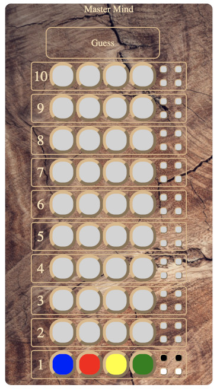

# Master Mind

<a href="screenshot.jpg">
<!--suppress CheckImageSize -->

</a>

The game of Master Mind, a coding exercise.

## Game rules

A two player game. One selects four pegs, each in one of six colors. The opponent is to guess which they are.

A guess is marked with black and white hints. A black hint means that a guess is right color and place, while
a white hint is for correct color but wrong place.

Given the information from the hints, the opponent can make another guess and eventually do a completely correct 
guess or run out of possible guesses, 10. In the latter case, the opponent has lost.

A nostalgic look at the game in [Wired magazine](https://www.wired.com/2012/06/late-tothe-game-mastermind/).

## Prerequisite

The following you should have with you from earlier:
- Running an Elm program with elm-watch.
- Elm: Random is a side effect.
- Unit tests in Elm.
- Understanding the Elm architecture.
- Handling user input in Elm.
- Introduction to HTML.
- Introduction to CSS.
- How to publish web pages on GitHub.

## Coding exercise

The coding exercise has two version, where the first is the easier. There is a design for the user interface created by someone you never met. Use it for inspiration.

There are unit tests which are being skipped. Make them all pass instead by implementing the logic.

Publish the end result in your portfolio on GitHub.

### Version 1

In this version, the application sets up the combination and the user try guess it. So the program's job is to randomly pick 4 colors, same or different, and then give the user hints for their guessing.

### Version 2

The second version has the computer doing the guessing. It can cheat of course, but that would be wrong.

